# 🛡️ TruthLens

> **Question Claims. Verify Facts.**

TruthLens is an AI-powered fact-checking system that analyzes YouTube videos by extracting factual claims, retrieving relevant online evidence, and evaluating whether the available evidence supports those claims.

---

## ✨ Features

* 🎥 Analyze YouTube videos from a URL
* 🎙️ Automatic speech transcription using Faster Whisper
* 🧠 AI-powered claim extraction and classification
* 🌐 Web evidence retrieval using Tavily Search
* 🤖 Claim verification using a local Gemma 3 model via Ollama
* 📊 Confidence-based verification reports
* 🔒 Runs locally for privacy

---

## 🏗️ How It Works

```text
YouTube URL
     │
     ▼
Download Audio (yt-dlp)
     │
     ▼
Speech-to-Text (Faster Whisper)
     │
     ▼
Claim Extraction (Gemma 3)
     │
     ▼
Claim Classification
     │
     ▼
Web Search (Tavily)
     │
     ▼
Evidence Collection
     │
     ▼
Verification (Gemma 3)
     │
     ▼
Fact-Checking Report
```

---

## 🛠️ Tech Stack

* Python
* Ollama
* Gemma 3
* Faster Whisper
* Tavily Search API
* yt-dlp

---

## 📂 Project Structure

```
TruthLens/
├── backend/
│   ├── downloader.py
│   ├── transcriber.py
│   ├── claim_extractor.py
│   ├── search.py
│   ├── verifier.py
│   ├── pipeline.py
│   └── main.py
├── data/
├── README.md
├── requirements.txt
└── .env.example
```

---

## 🚀 Installation

```bash
git clone https://github.com/sparsh1536/TruthLens.git

cd TruthLens

python -m venv venv

source venv/bin/activate

pip install -r requirements.txt
```

Create a `.env` file:

```env
TAVILY_API_KEY=your_api_key_here
```

Run:

```bash
python backend/main.py
```

---

## 📸 Demo

### 1. 🎥 Input Video

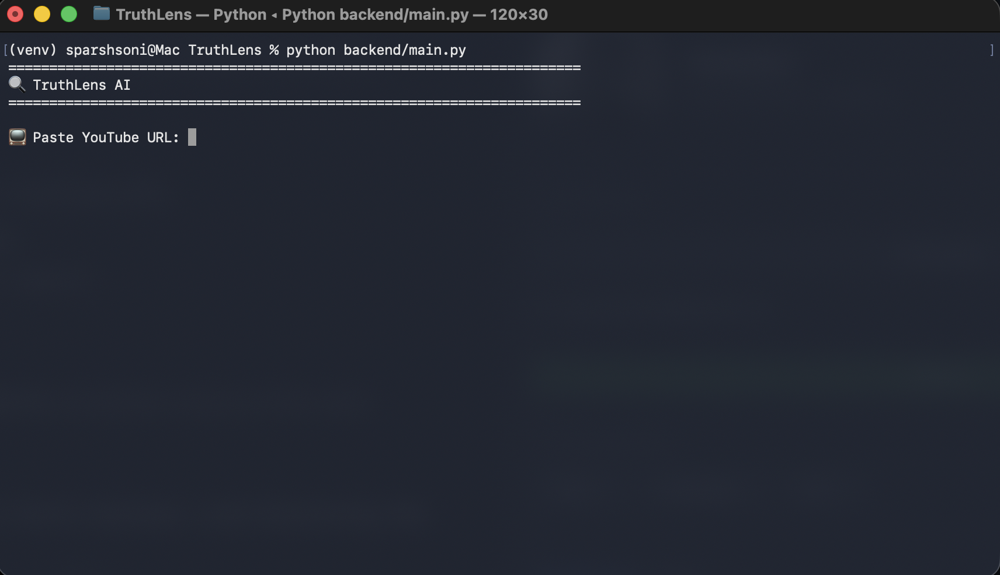

---

### 2. ⬇️ Audio Download

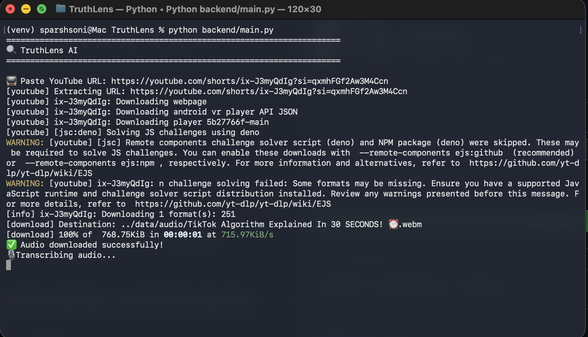

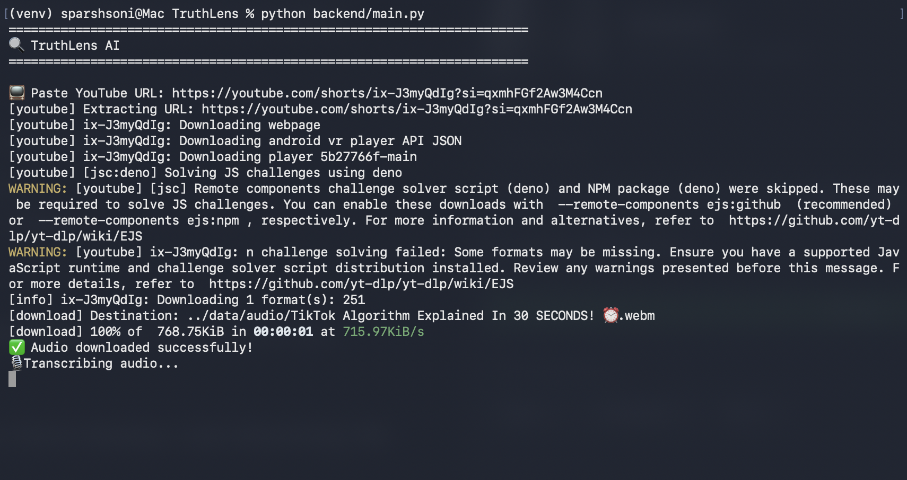

---

### 3. 🧠 Claim Extraction, 🌐 Evidence Collection & 🤖 AI Verification

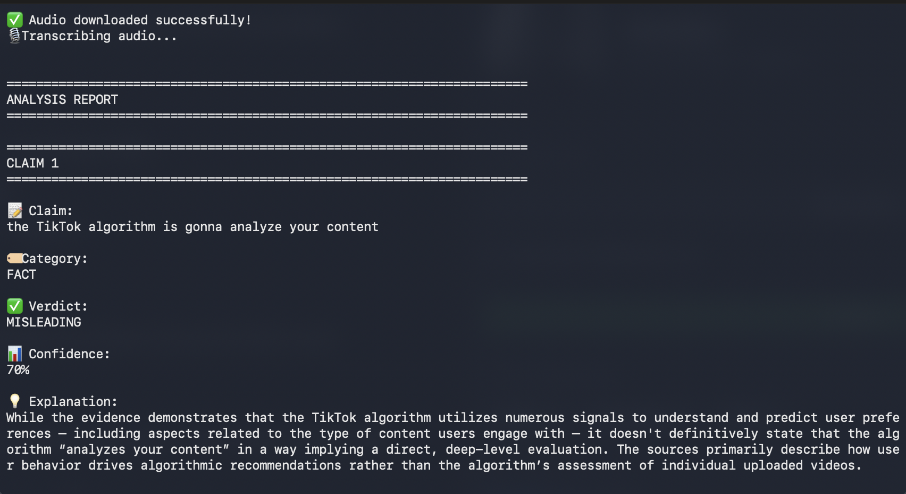

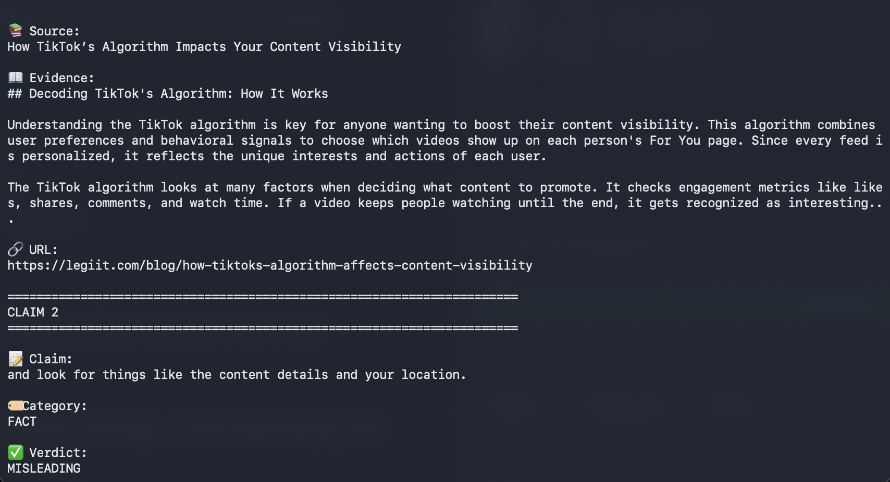

---

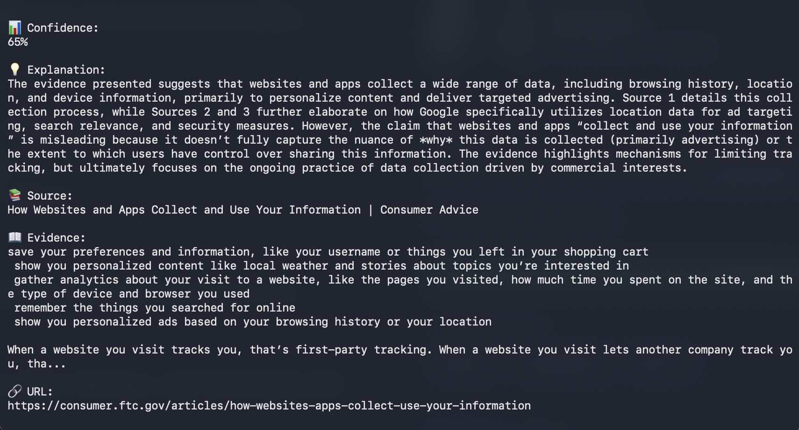

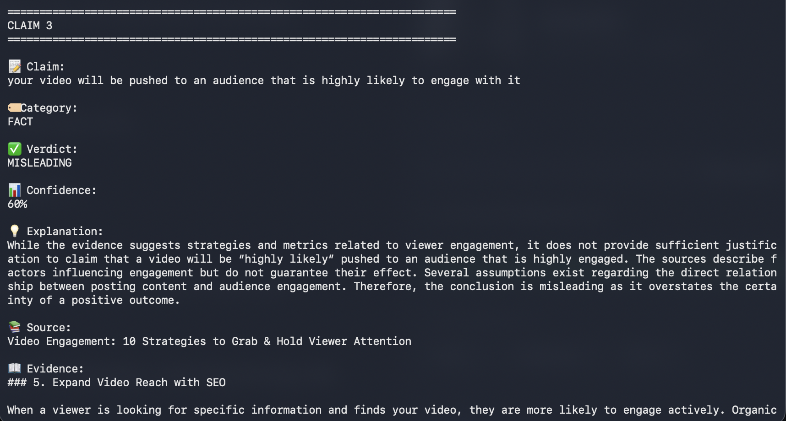

---

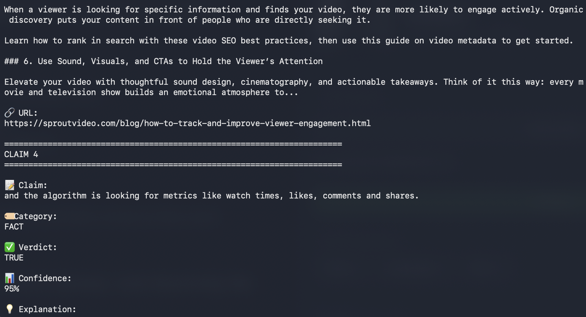

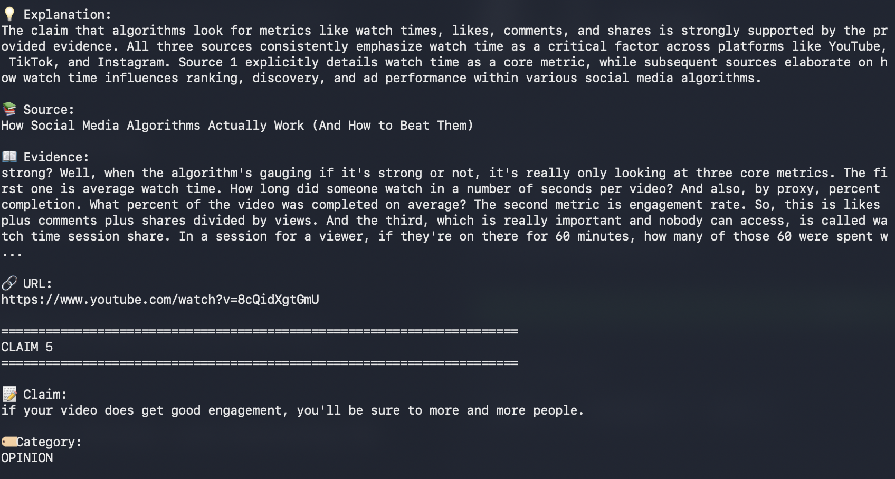

---

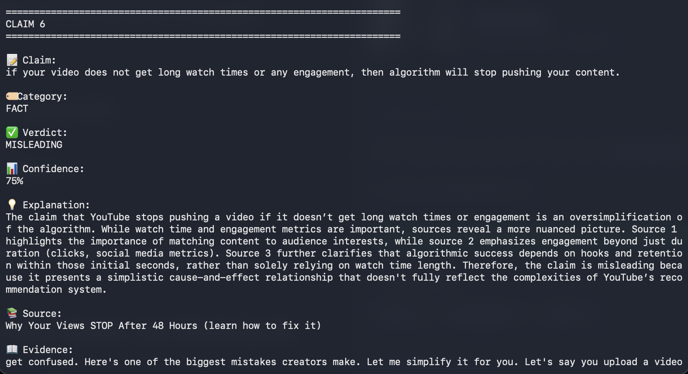

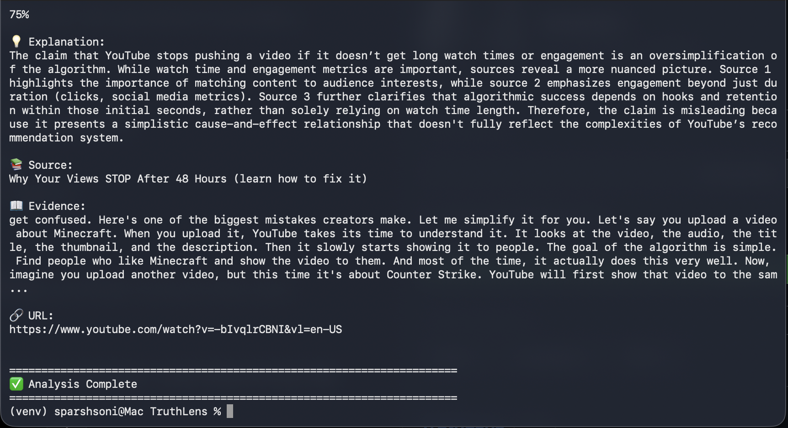

---

## 📌 Roadmap

* [x] YouTube audio extraction
* [x] Speech transcription
* [x] Claim extraction
* [x] Web evidence retrieval
* [x] AI verification
* [ ] Web interface
* [ ] Parallel verification
* [ ] Multi-language support
* [ ] PDF & News article fact-checking

---

## 👨‍💻 Author

**Sparsh Soni**

GitHub: https://github.com/sparsh1536

---